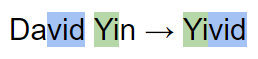
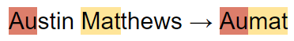
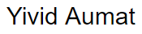
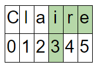
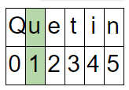
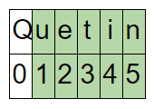
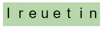

# SciFi Name

Write a scifi_name() function that takes in a person's full name, the name of their elementary school and their city of residence as arguments and returns their SciFi name.
 
### Rules of generating a SciFi name:
Your first SciFi name will be generated using the following algorithm:

1. Using the substring methods, get the last three letters of your first name.
2. Similarly, get the first two letters of your last name.
3. Using concatenation, combine the last three letters of your first name to the first two letters of your last name to generate your Sci-fi first name.

 
 

Likewise, your SciFi last name will be generated using a similar algorithm:

1. Get the first two letters of the city you were born in.
2. Get the get the first three letters of your elementary (or previous) school.
3. Using concatenation, combine these results to generate your Sci-Fi last name.

 

Concatenate the first and last names. The scifi_name() function should return the full name.

  
  
# SciFi Origin

Write a scifi_origin() which takes in two friends' first names as arguments and returns your place of birth.
 
### Rules of Generating a SciFi Place of Origin:
Your Sci-Fi place of origin will be more randomly generated and will extract letters from the end of a name:

1. Generate a random number between 1 and (length – 1) of a friend’s first name. For example, the result may be 3 as shown in the table: 

2. Get the last letters of your friend’s first name beginning at the random location through to the end of the string.

3. Generate a random number between 1 and (length – 1) of another relative’s name. 

4. Get the last letters of this name beginning at the random location through to the end of the string.

5. Using concatenation, combine the results from Step 2 and Step 3 to generate your SciFi place of origin.

